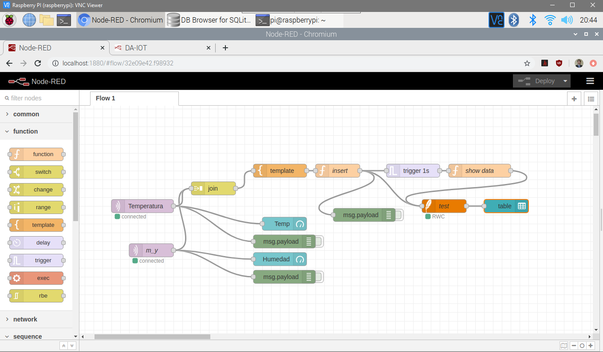
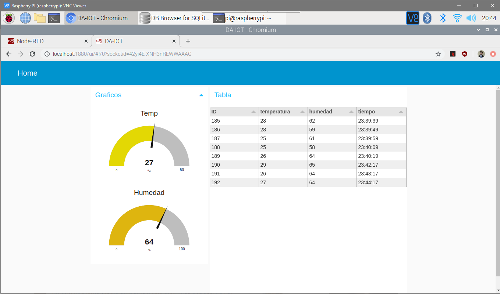

# Desarrollo de aplicaciones para IoT

- [x] ESP32
- [x] Broker mosquito
- [x] Node-red
- [x] Base de datos SQlite
- [ ] Back-end Nodejs
- [ ] Front-end Ionic

# ESP32

# Broker

# Node-red

## Conexión de bloques en Node-red

Se tomaron los datos de 2 topicos: temperatura y la componente y del campo magnético provistos por el MPU9250. Ambos datos van a sus respectivos gauges y son combinados en un vector que es ingresado a la función insert que realiza un insert a la base de datos con la hora actual. Luego se dispara un trigger de 1 segundo para realizar un select a la base de datos para visualizarla en una tabla.

En node-red:1880/ui se puede ver una versión preliminar donde cada minuto aparece un nuevo dato que se agrega a la base de datos y se visualiza en los gauges.

# Base de datos SQlite

# Back-end NodeJS

# Front-end Ionic
