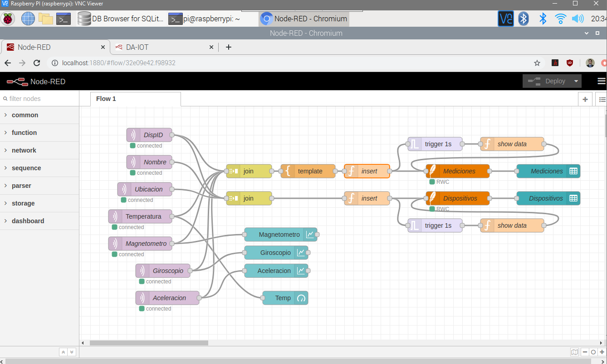
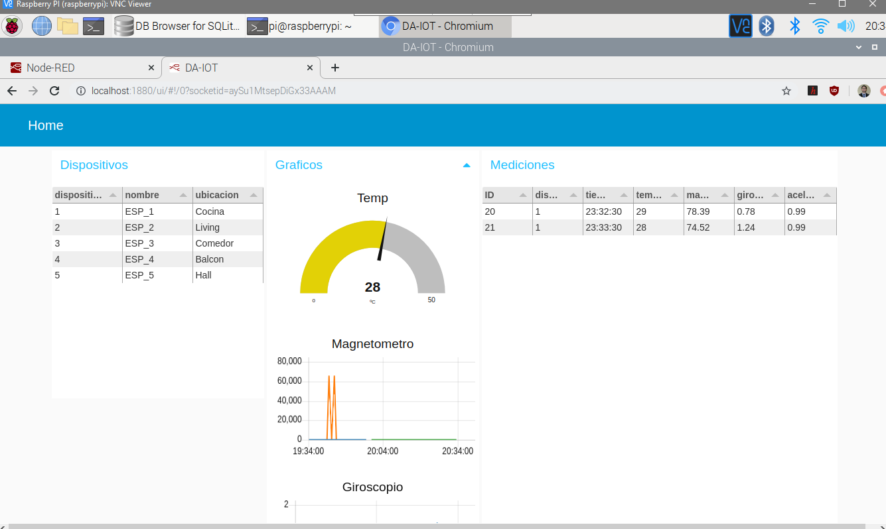
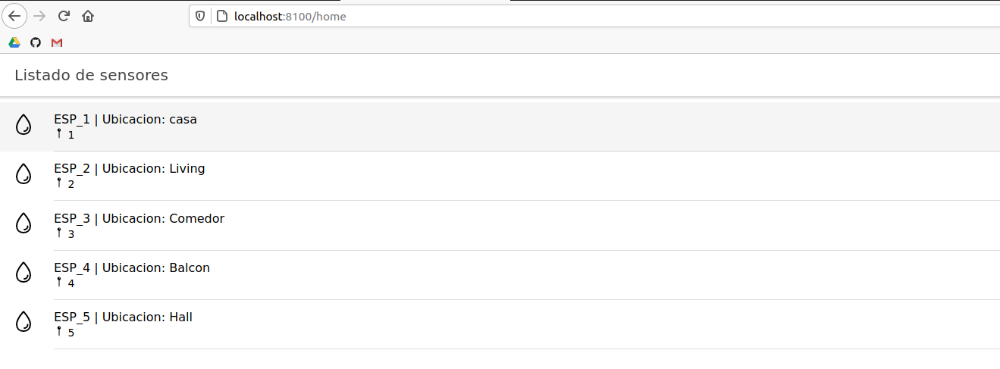
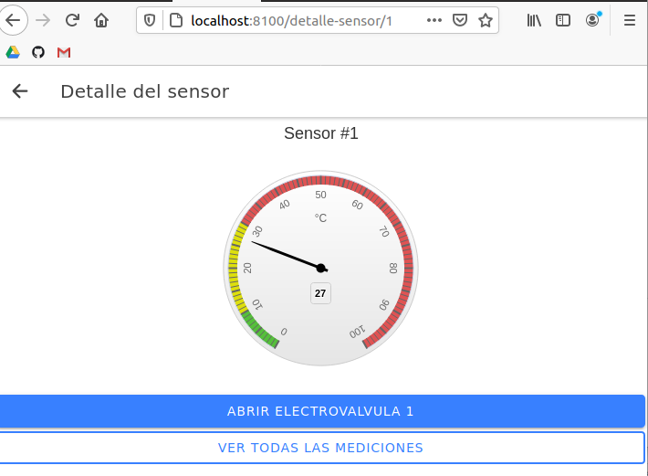
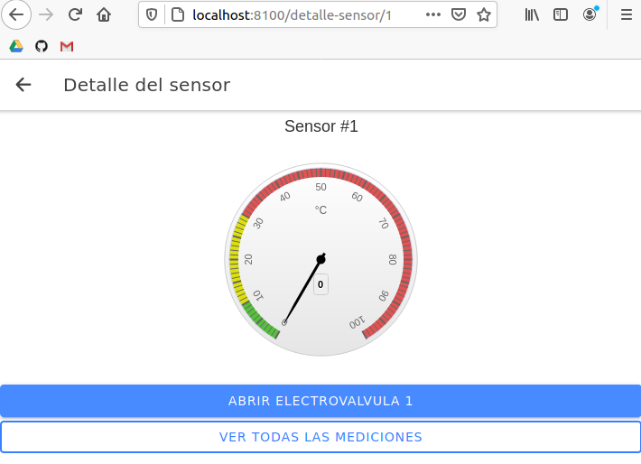

# Desarrollo de aplicaciones para IoT

- [x] ESP32
- [x] Broker mosquito
- [x] Node-red
- [x] Base de datos SQlite
- [x] Back-end Nodejs
- [x] Front-end Ionic

# ESP32

Se utilizo una version propia de código arduino en el cual se lee un MPU9250. La biblioteca permite leer las 3 componentes del campo magnético, las 3 componentes del giroscopio y las 3 componentes del acelerometro. Lamentablemente la temperatura no esta implementada, aunque el MPU9250 lo soporta, para una versión preliminar se simula la temperatura como un rand entre 25 y 30.


Se envía el dato por MQTT al puerto 192.168.0.239, el puerto de la Raspberry Pi donde se tiene el broker y la base de datos.

# Broker

Se instalo el broker mosquito.

# Node-red

## Conexión de bloques en Node-red

Se tomaron los datos de 2 topicos: temperatura y la componente y del campo magnético provistos por el MPU9250. Ambos datos van a sus respectivos gauges y son combinados en un vector que es ingresado a la función insert que realiza un insert a la base de datos con la hora actual. Luego se dispara un trigger de 1 segundo para realizar un select a la base de datos para visualizarla en una tabla.



En node-red:1880/ui se puede ver una versión preliminar donde cada minuto aparece un nuevo dato que se agrega a la base de datos y se visualiza en los gauges.

 


# Base de datos SQlite


Se crearon dos tablas, una para listar los dispositivos y otra para sus mediciones.

## Dispositivos

| dispositivoID | nombre | ubicacion |
| :-: | :-: | :-: |
| 1 | 'ESP32_1'  | 'Habitacion' |
| 2 | 'ESP32_2'  | 'Living' |
| 3 | 'ESP32_3'  | 'Balcon' |

## Mediciones

| ID | dispID | tiempo | temperatura | magnetico | giroscopio | aceleracion |
| :-: | :-: | :-: | :-: | :-: | :-: | :-: |
| 1 | 1 | 11:14:12 | 25 | 60 | 30 | 20 |
| 2 | 1 | 11:14:14 | 27 | 64 | 34 | 23 |
| 3 | 2 | 11:14:54 | 24 | 57 | 50 | 18 |
| 4 | 1 | 11:15:04 | 23 | 50 | 32 | 21 |

# Back-end NodeJS
## Para levantar el back-end

Moverse hasta la carpeta Back_end/database para correr los scripts.
```sh
cd Back_end
cd database
./mysql.sh
./phpmyadmin.sh
```
Si ya se tiene un proceso de MySQL ocupando el puerto por defecto (3306) se debe dar de baja MySQL previamente con

```sh
 sudo systemctl stop mysql-server
```
o
```sh
sudo service mysql stop
```
Con ambos scripts funcionando volver a la carpeta Back_end y correr

```sh
node index.js
```

Y se debera ver el mensaje "Api funcionando".

# Front-end Ionic 
## Para levantar el Front-End

Moverse hasta la carpeta Front_end y ejecutar

```sh
ionic serve -o
```

Lo cual abrira una pestaña del navegador en "http://localhost:8100/home" y se debera ver lo siguiente:



Eligiendo cualquiera de los dispositivos se puede acceder a los datos del sensor.

## Sensor del dispositivo

Al ingresar se visualizara el sensor con el valor por defecto (ultimo cargado en la base de datos)


Al presionar "cerrar electrovalvula" el boton cambiara a "abrir electrovalvula", se impondra un valor de 0 en el sensor y se guardaran los datos en el log.



Al presionar "abrir electrovalvula" el boton cambiara a "cerrar electrovalvula", se cargara el valor de temperatura anterior en el sensor y se guardaran los datos en el log.


En ambos casos el valor de "valvula" se actualizara en la base de datos, con el timestamp correspondiente.

## Medicion

Al presionar "ver todas las mediciones" se puede acceder al historial de mediciones, donde figura el ID de las mismas, la fecha (con formato pipe custom) en que ocurrieron y el valor de los sensores (temperatura, campo magnetico, giroscopo, aceleracion) y la apertura de valvula indicara "Cerrado" en rojo (directiva custom) si el nivel de apertura es 0%.

# Contribuir
Para contribuir realizar un pull request con las sugerencias.

Al ser un proyecto autoconclusivo, solo con fines académicos, no tendrá mantenimiento futuro.
# Licencia
GLP
